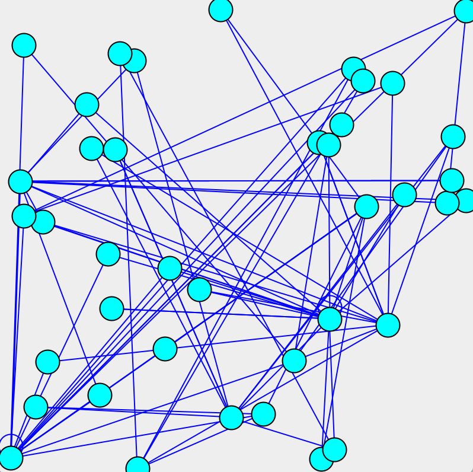
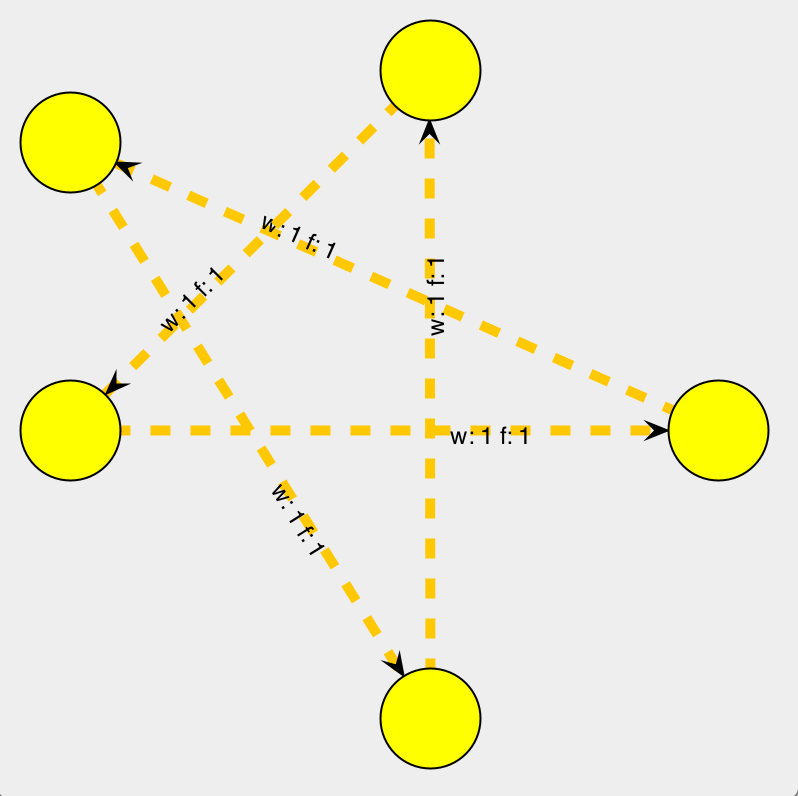
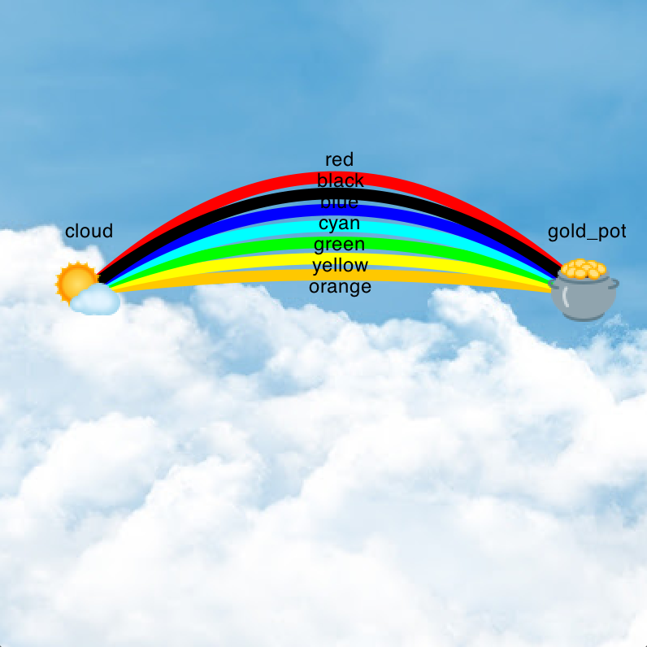

# GraphViewer

**GraphViewer** is a tool for **graph visualization** based on the JUNG framework, in the context of the **Algorithm Design and Analysis** course, at **FEUP**. It has been developed and mantained over the years by the course's Teaching Assistance students.

Here follows a tutorial on how students could **setup the CLion IDE and run an example project** with 3 different graphs being loaded.

## Setting up the environment (CLion IDE)

1. Apply for a JetBrains Educational Pack using the link: https://www.jetbrains.com/shop/eform/students and using you upXXXXXXXXX@fe.up.pt, so that JetBrains identifies you as a real student.
2. Install CLion. Somewhere during the installation, you should be prompted to active you JetBrains account. Please insert the credentials you obtained in the previous step ("Get Licence From:" => "JB account")
3. Install a JDK (it is likely that you already have one)
4. If you are using Windows, you might need to setup an environment. You can find documentation on how to do it here: https://www.jetbrains.com/help/clion/quick-tutorial-on-configuring-clion-on-windows.html
5. For more details or other issues, please use https://www.jetbrains.com/help/clion/clion-quick-start-guide.html

## Running the example

1. Clone / Download this respository
2. Open CLion > Open > Choose the example dir in the repository
3. Run the project. You will the following three different graphs being loaded, in different windows

